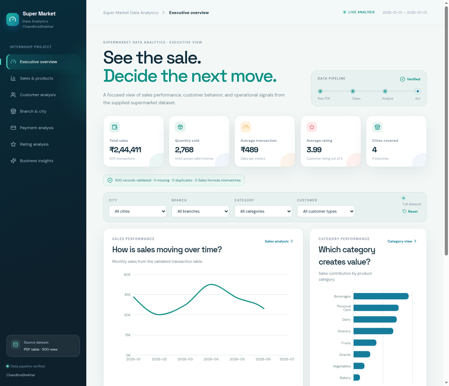
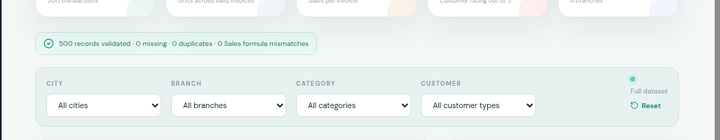
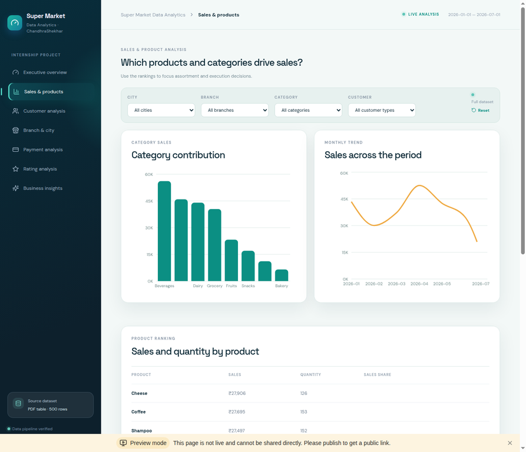
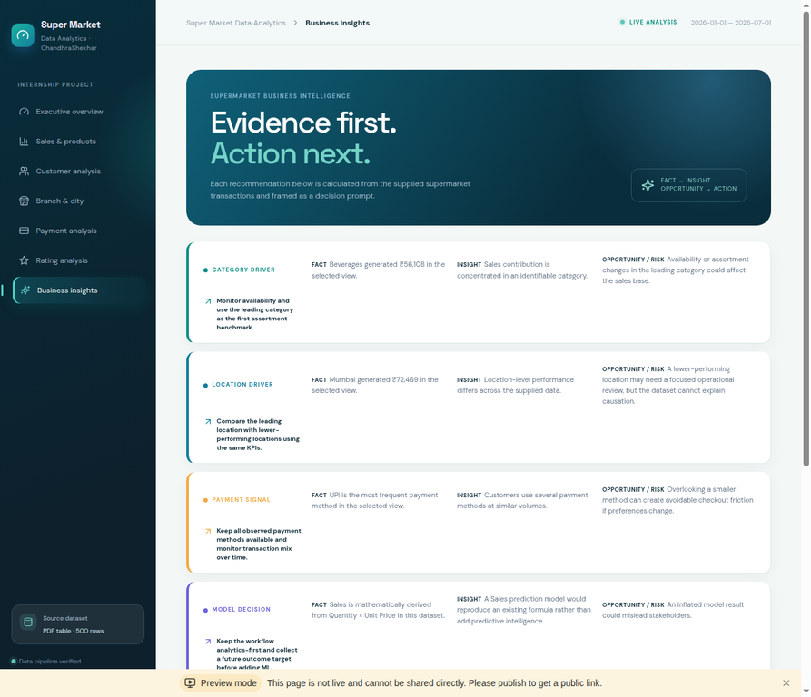

# SuperMarket Data Analytics

## Student and internship

**Student:** ChandhraShekhar  
**Internship:** IBM SkillsBuild Data Analytics with AI Academic Internship Program  
**Conducted by:** BharatCares in association with AICTE

## Project overview

This project analyzes the supplied supermarket transaction dataset and converts validated records into business information, evidence-led insights, decisions, and actions. The workflow is **DATA → INFORMATION → INSIGHT → DECISION → ACTION**. The Jupyter notebook, report, dashboard, and README use the same 500-row CSV dataset.

## Problem statement

Raw supermarket transactions do not immediately show which categories, products, cities, branches, customer segments, payment methods, or rating groups deserve attention. The project provides a reproducible descriptive analytics and Business Intelligence view without inventing profit, margin, retention, churn, or causal effects that are not supported by the source fields.

## Objectives

- Validate and clean the supplied transaction table.
- Calculate reliable sales, quantity, transaction, rating, product, category, branch, city, customer, payment, and time KPIs.
- Explain important findings with FACT → INSIGHT → OPPORTUNITY/RISK → ACTION.
- Provide a working interactive web application for stakeholder exploration.
- Make an honest modeling decision based on the available data and leakage risk.

## Dataset

The actual dataset was extracted from the supplied PDF and saved as `dataset/supermarket_data.csv`. It contains **500 rows and 13 columns**: Invoice ID, Date, Branch, City, Customer Type, Gender, Product, Category, Quantity, Unit Price, Payment, Rating, and Sales. Sales was validated against Quantity × Unit Price.

### Column descriptions

| Column | Description |
|---|---|
| Invoice ID | Unique transaction identifier |
| Date | Transaction date |
| Branch / City | Store branch and city |
| Customer Type / Gender | Customer segment fields |
| Product / Category | Purchased item and grouping |
| Quantity | Units in the transaction |
| Unit Price | Price per unit |
| Payment | Payment method |
| Rating | Customer feedback rating from 0 to 5 |
| Sales | Transaction sales value |

**Dataset Source: To be added manually.** The supplied PDF did not include a genuine public source URL. This is the one manual item to complete before internship submission if the original source link is available.

## Data quality and cleaning

The project verifies data types, missing values, duplicate rows, duplicate Invoice IDs, date validity, positive Quantity and Unit Price, valid ratings, and Sales = Quantity × Unit Price. The validated extract has **0 missing values, 0 duplicate rows, 0 duplicate Invoice IDs, and 0 Sales formula mismatches**. Dates and analytical features are parsed in the notebook; valid source records are retained rather than silently altered.

## Analysis methodology

The notebook calculates descriptive statistics and KPIs, monthly trends, product and category rankings, branch/city comparisons, customer type and gender summaries, payment-method mix, rating distributions, category ratings, and descriptive outlier information. Visualizations are limited to meaningful business questions.

## KPIs and actual findings

- Total Sales: **₹244,411.08**
- Transactions: **500**
- Quantity sold: **2,768 units**
- Average transaction: **₹488.82**
- Average rating: **3.99 / 5**
- Cities covered: **4**
- Leading category by Sales: **Beverages**
- Leading product by Sales: **Cheese**
- Leading city by Sales: **Mumbai**
- Most frequent payment method: **UPI**

## Business insights and recommendations

1. **Category and product contribution:** use leading categories and products as operational benchmarks, while reviewing lower-performing segments before shifting inventory or campaign attention.
2. **Branch and city differences:** compare store execution and availability across locations; the dataset shows association, not causation, so operational reasons should be validated separately.
3. **Customer and payment mix:** use transaction counts and sales contribution to plan service coverage and maintain stable payment availability.
4. **Ratings:** use category and branch rating comparisons as feedback signals for service review, not as proof that a single factor caused satisfaction.

## Predictive-modeling decision

Sales prediction is not used because Sales is deterministically derived from Quantity × Unit Price and would create leakage or merely reproduce a formula. The notebook retains a transparent exploratory Rating model for methodology comparison, but it is not treated as a production forecast because it does not outperform the mean baseline on the held-out data.

## Technologies

Python, pandas, NumPy, Matplotlib, Seaborn, scikit-learn, Jupyter Notebook, React, TypeScript, Vite, Recharts, and Lucide icons.

## Project structure

```text
SuperMarketDataAnalytics/
├── README.md
├── requirements.txt
├── SuperMarketDataAnalytics.ipynb
├── SuperMarketDataAnalytics_ProjectReport.docx
├── dataset/
│   └── supermarket_data.csv
└── web_application/
    ├── README.md
    ├── package.json
    ├── src/
    ├── public/
    ├── server/
    ├── shared/
    └── Vite/TypeScript configuration
```

## Installation and execution

### Notebook

```bash
pip install -r requirements.txt
jupyter notebook SuperMarketDataAnalytics.ipynb
```

Run all cells from the repository root so the relative path `dataset/supermarket_data.csv` resolves correctly.

### Web application

```bash
cd web_application
pnpm install
pnpm check
pnpm dev
```

For a production build, run `pnpm build`. The dashboard uses the same validated records embedded in `web_application/src/data.ts`; no API key or backend credential is required.

## Web Application Preview

The following previews are screenshots of the actual working SuperMarket Data Analytics application running against the validated 500-row dataset. The source files are stored in `web_application/screenshots/`.

### Dashboard / Executive Overview



The executive overview presents verified Sales, Quantity, Average Transaction, Average Rating, and Cities Covered KPIs, together with the monthly sales trend, category contribution, product ranking, and synchronized filters.

### Data Quality



This validation view shows the actual pipeline status: 500 records validated, 0 missing values, 0 duplicates, and 0 Sales formula mismatches. The filters can narrow the analysis by city, branch, category, or customer type.

### Exploratory Analysis



The Sales & Products page compares category contribution, monthly sales across the period, and product-level Sales and Quantity rankings to support assortment and execution decisions.

### Business Insights / Risks and Opportunities



The Business Insights page translates calculated findings into FACT → INSIGHT → OPPORTUNITY/RISK → ACTION statements for category, location, payment, and modeling decisions, while stating the dataset limitations.

## Limitations

The source is a static six-month extract and does not include margin, inventory, promotions, payment failures, or longitudinal customer history. Therefore the project cannot calculate profit, margin, retention, churn, or causal effects.

## Future scope

Add a validated date-range filter, inventory and margin fields, promotion and payment-failure data, longer customer history, and a genuine future outcome target before introducing operational predictive modeling.

## Conclusion

The project provides a reproducible SuperMarket Data Analytics submission and an interactive Business Intelligence dashboard grounded in the supplied dataset.
